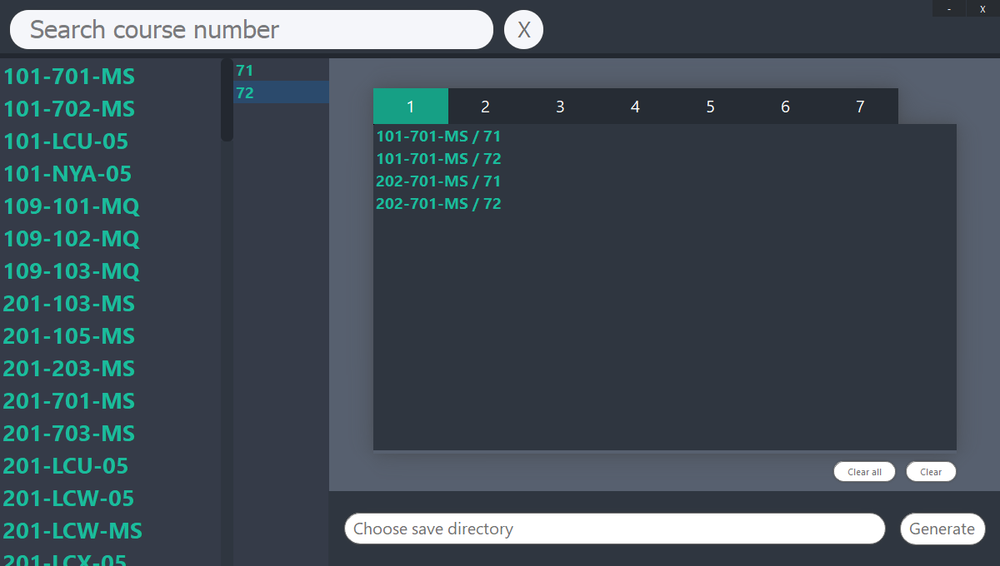
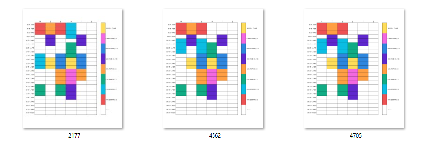
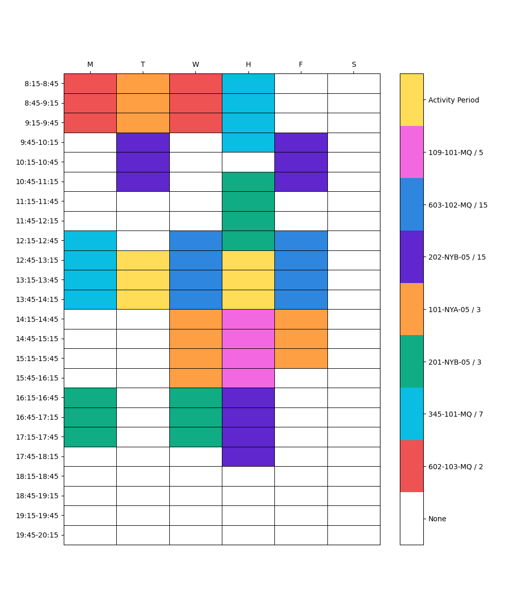

# Class Schedule Generation Tool

A tool to help students create their perfect class schedule.

Students select all the courses and course sections that they want
to take, and the tool will generate all valid schedules. The students
can then go through the generated schedules and pick the one that suits them the best.

## Preview

**App**

**Generated Schedules**

**Schedule Example**

